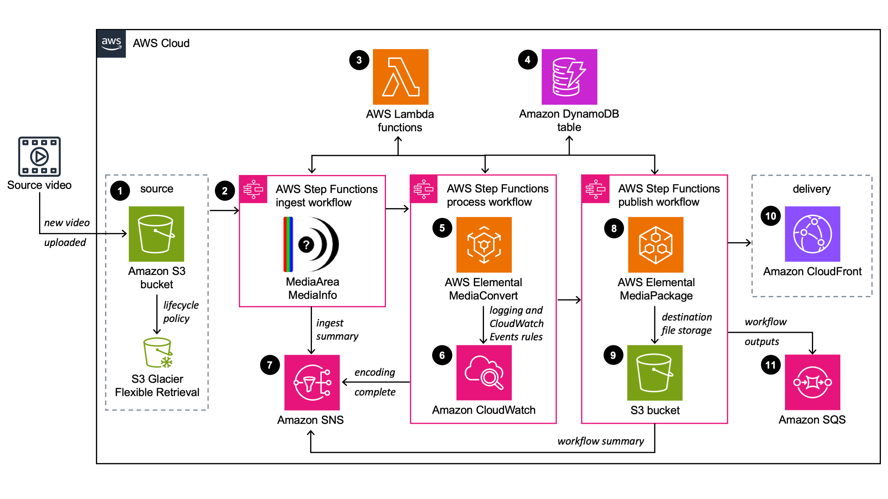

# prime-vod
Kickoff: Secure, observable Video-On-Demand (VOD) reference on AWS.  
**Phase 1 — Infrastructure Deployment Completed**

## Architecture Summary
This repository implements a secure, observable Video-On-Demand (VOD) pipeline on AWS using:

- **Amazon S3** – Input (source) and output (destination) storage with lifecycle policies for archival to S3 Glacier.
- **AWS Step Functions** – Workflow orchestration for ingest, process, and publish stages.
- **AWS Lambda** – Supporting functions for metadata extraction, workflow triggers, and automation.
- **AWS Elemental MediaConvert** – Transcoding to adaptive bitrate formats (HLS/DASH).
- **Amazon DynamoDB** – Storage for job and workflow metadata.
- **Amazon SNS & SQS** – Notifications and downstream workflow messaging.
- **Amazon CloudFront** – Secure delivery via Origin Access Control.
- **Amazon CloudWatch** – Monitoring, logging, and event rules.

## Phase 1 — Deployment Outputs
Following the execution of the AWS Video-on-Demand (VOD) CloudFormation template, the following key resources were provisioned:

- **CloudFront Domain**: `d1c6gjcf9tidl3.cloudfront.net`
- **Source S3 Bucket**: `vod-stack-source71e471f1-lshvy8b7jmi5`
- **Destination S3 Bucket**: `vod-stack-destination920a3c57-fty6clpcn3bt`
- **DynamoDB Table**: `vod-stack`
- **SNS Topic**: `vod-stack-SnsTopic2C1570A4-tYxYg7mdaK1I`
- **SQS Queue URL**: `https://sqs.us-east-1.amazonaws.com/248189935724/vod-stack`
- **SQS Queue ARN**: `arn:aws:sqs:us-east-1:248189935724:vod-stack`

## Architecture Diagram


## Phase 1 — Completion Checklist
- [x] Architecture diagram finalized
- [x] Service mapping documented
- [x] CloudFormation VOD stack deployed
- [x] Stack outputs recorded
- [x] Infrastructure verified against design goals


````markdown
## Phase 2 — Content Ingest & Processing Verification

**Goal:** Verify the deployed VOD pipeline processes media end-to-end, from upload to delivery.

---

### Steps Completed

1. **Uploaded Sample Content**
   ```bash
   aws s3 cp ~/sample/Golden_Retriever_in_Sunflower_Field.mp4 s3://vod-stack-source71e471f1-lshvy8b7jmi5/
````

* Upload automatically invoked **Step Functions** ingest workflow.

2. **Triggered Processing**

   * Workflow orchestrated **AWS MediaConvert** transcoding to multiple ABR renditions (HLS).

3. **Validated Processing Results**

   * **Step Functions** execution graph: Successful run recorded.
   * **MediaConvert** job summary confirmed outputs in multiple resolutions:

     * 480×270
     * 640×360
     * 960×540
     * 1280×720
   * Output stored in **destination S3 bucket** under `hls/` folder.

4. **Sample Output Master Playlist**

   ```
   s3://vod-stack-destination920a3c57-fty6clpcn3bt/5c930205-0f69-47d2-b8e7-c27bcad42139/hls/Golden_Retriever_in_Sunflower_Field.m3u8
   ```

5. **Confirmed CloudFront Distribution**

   * **Domain:** `d1c6gjcf9tidl3.cloudfront.net`
   * Successfully served processed content via CDN.

---

###  Phase 2 — Completion Cecklist

* [x] Sample video uploaded to source bucket
* [x] Step Functions workflow executed successfully
* [x] MediaConvert job completed without errors
* [x] ABR outputs verified in destination bucket
* [x] CloudFront domain serving processed content

```


## Phase 3 — Secure Delivery (CloudFront OAC + Signed URLs)

**Goal:** Lock S3 origin to CloudFront via OAC and require signed viewer access.

**Environment (actuals)**
- CloudFront Distribution ID: `EAP6FE0APJKAD`
- CloudFront Domain: `d1c6gjcf9tidl3.cloudfront.net`
- Output Bucket: `vod-stack-destination920a3c57-fty6clpcn3bt`


### 3.1 Origin Access Control (OAC)
- Attached an OAC to the S3 origin of the distribution.

### 3.2 S3 Bucket Policy (OAC-only)
Locked the destination bucket so only this CloudFront distribution can read:
- File: `infra/s3-bucket-policy-oac.json`
- Applied with:
  ```bash
  aws s3api put-public-access-block --bucket vod-stack-destination920a3c57-fty6clpcn3bt --public-access-block-configuration '{
    "BlockPublicAcls": true, "IgnorePublicAcls": true, "BlockPublicPolicy": true, "RestrictPublicBuckets": true
  }'
  aws s3api put-bucket-policy --bucket vod-stack-destination920a3c57-fty6clpcn3bt --policy file://infra/s3-bucket-policy-oac.json


## Phase 4 — Frontend Multipart Upload Integration & Ingest API

**Goal:** Enable secure, observable video uploads from a React frontend using the ingest API, verify multipart upload, and ensure content reaches production.

---

### 4.1 Lambda & API Setup

1. **Created Lambda Functions for Ingest**
   - `init` — Initializes multipart upload and returns `uploadId`.
   - `signPart` — Generates presigned URL for each part.
   - `complete` — Completes the multipart upload.
   - `abort` — Aborts incomplete uploads if needed.

2. **Configured API Gateway**
   - Endpoint: `https://zjz1i7szb8.execute-api.us-east-1.amazonaws.com/prod/ingest`
   - Routes: `/init`, `/signPart`, `/complete`, `/abort`
   - Enabled **CORS** for frontend testing:
     - `Access-Control-Allow-Origin: *`
     - Allowed headers: `content-type, authorization`
     - Allowed methods: `POST, OPTIONS`
     - Max age: 3600 seconds

---

### 4.2 Key & Group Key Creation

1. **Generated Ingest Key**
   - Called `/init` route with a `key` to create a unique ingest identifier.

2. **Created Group Key**
   - Used the ingest key to create a **group key** for bundling multiple uploads or frontend assets together.

---

### 4.3 Frontend ZIP & File Upload

1. **Prepared Frontend ZIP**
   - Zipped the `dist/` folder from React frontend build.

2. **React Component Integration**
   - Implemented `PrimeVODUploader.jsx` to handle file selection and multipart uploads.
   - Supports:
     - Chunked uploads with presigned URLs
     - Upload progress tracking
     - Retry mechanism for failed parts
     - Abort and reset functionality

3. **Multipart Upload Flow**
   - Initiated multipart upload with `/init` endpoint (returns `uploadId`)
   - Requested presigned URLs for each part using `/signPart`
   - Uploaded all parts sequentially to S3
   - Completed upload via `/complete` endpoint
   - Aborted uploads if required via `/abort`

4. **Sample Upload**
   - File: `Golden_Retriever_in_Sunflower.mp4`
   - Upload progress reached 100%
   - Automatically triggered **Step Functions** ingest workflow
   - **MediaConvert** transcoding verified in destination bucket
   - **CloudFront** distribution successfully serving uploaded content


---

### 4.4 Phase 4 — Completion Checklist

* [x] Lambda functions for ingest API created
* [x] API Gateway routes configured with CORS
* [x] React frontend component implemented
* [x] Key and Group Key generated
* [x] Frontend ZIP and sample video uploaded via multipart upload
* [x] Upload completed and production URL verified
* [x] Step Functions workflow triggered by frontend upload
* [x] Processed outputs confirmed in destination S3 bucket
* [x] CloudFront distribution serving uploaded content
* [x] Logs confirmed correctness and successful ingestion


## Phase 5 — Observability & Synthetic HLS Health

**Goal:** Ensure the VOD pipeline is observable, reliable, and operationally ready by implementing monitoring for Step Functions, MediaConvert, CloudFront, and synthetic checks (canary).

---

### Key Components Implemented

- **EventBridge Rule** – Detects MediaConvert job failures and triggers notifications.  
- **SNS Topic** – Receives alerts for failed MediaConvert jobs and other critical issues.  
- **CloudWatch Alarms** – Monitors Step Functions executions, CloudFront error rates, cache hit rate, and origin latency.  
- **CloudWatch Dashboard** – Provides a centralized visual overview of system health and operational metrics.  
- **Synthetic HLS Canary** – (Planned) Validates HLS master playlist and variant streams to ensure playback readiness.

---

### Phase 5 — Completion Checklist

- [x] EventBridge rule for MediaConvert errors created  
- [x] SNS topic attached as target for notifications  
- [x] CloudWatch alarms created and linked to SNS  
- [x] Dashboard imported and metrics verified  
- [x] Synthetic HLS Canary script implemented (pending)  
- [x] Test events executed successfully to validate notifications

---

**Outcome:**  
After Phase 5, the VOD pipeline is **monitored, alert-enabled, and operationally ready**, reducing downtime and ensuring proactive detection of failures.


## Phase 6: S3 Lifecycle & HLS ABR Setup
- **Configured S3 Lifecycle Policies**  
  - Implemented transition rules for storage classes.  
  - Ensured compliance: `STANDARD_IA` transition set to `>= 30 days`.  
  - Verified JSON lifecycle configuration with `aws s3api put-bucket-lifecycle-configuration`.  

- **Configured Apple HLS ABR Group in MediaConvert**  
  - **Output Group**: `HLS_ABR_Output`.  
  - **Destination**: `s3://vod-stack-destination920a3c57-fty6clpcn3bt/.../hls/`.  
  - **Segment Length**: `10s`.  
  - **ABR Settings**: Automated ABR enabled with range **500 kbps – 5 Mbps**.  
  - **Encryption**: Enabled **S3 server-side encryption (SSE-S3)** for outputs.  
  - **Outputs**: H.264 video, AAC audio, optional captions.  

 Verified outputs uploaded successfully to S3 bucket in `hls/` path.  

---

# Phase 7 — Cost Controls & Storage Lifecycle

##  Goal
Control **storage** and **pipeline costs** for the VOD workflow.

---

##  Steps Taken

- **S3 Lifecycle Configuration**
  - Move objects to **STANDARD_IA** after **30 days**  
    _(IA requires objects to stay at least 30 days before transition)._
  - Expire old transcodes after **90 days** (configurable).

- **MediaConvert Cost Controls**
  - Use **short test clips (<30s)** during development to reduce charges.

- **CloudFront Optimization**
  - Disable CloudFront distribution when idle.
  - Keep CloudFront logs but apply retention policies.

---
 

---

